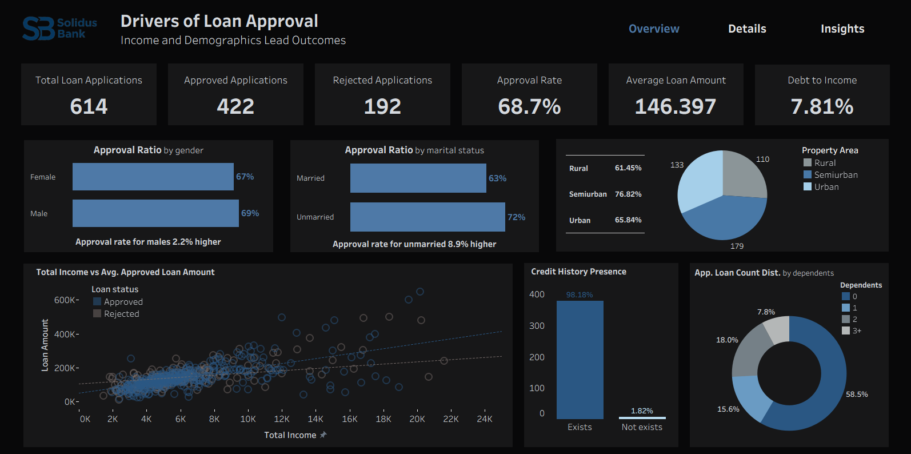
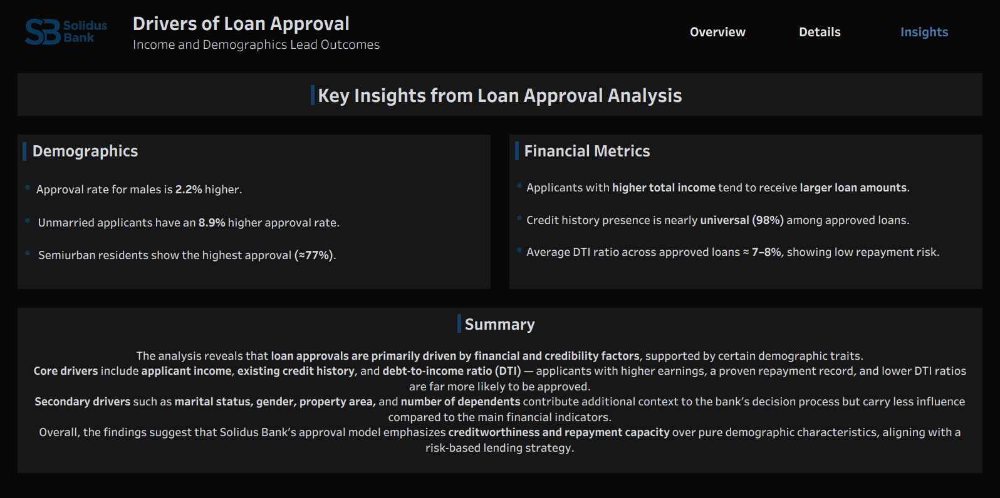

# Loan Approval Analysis

## About the Project
This project analyzes the factors influencing loan approval decisions for a fictional financial institution.  
The goal is to identify how applicant demographics and financial indicators affect loan outcomes and to visualize the results through an interactive Tableau dashboard.  
The workflow includes **data preparation**, **SQL-based analysis**, and **dashboard storytelling**.

## Data
The dataset contains **614 loan applications** with details such as:
- Applicant demographics (gender, marital status, dependents, property area)
- Financial attributes (income, loan amount, EMI, DTI ratio, credit history)
- Loan outcome (approved / rejected)

Source file: `data/loan_approval_data.csv`

## SQL Queries
1. **Data Preparation (`loan_approval_prep.sql`)**  
   - Cleaned missing values and standardized numeric fields  
   - Derived new metrics: debt-to-income ratio, loan-to-income ratio, EMI calculation  

2. **Business Questions (`loan_approval_analysis.sql`)**  
   - Explored approval ratios by gender, marital status, income group, and property area  
   - Examined how financial metrics (DTI, credit history, income) relate to approval outcomes  

## Tableau Dashboard
Click any image to open the **interactive version on Tableau Public**.

  
  

  

