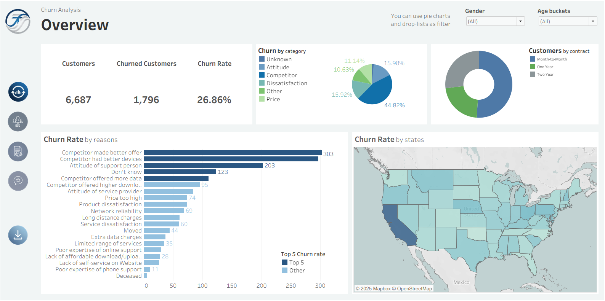
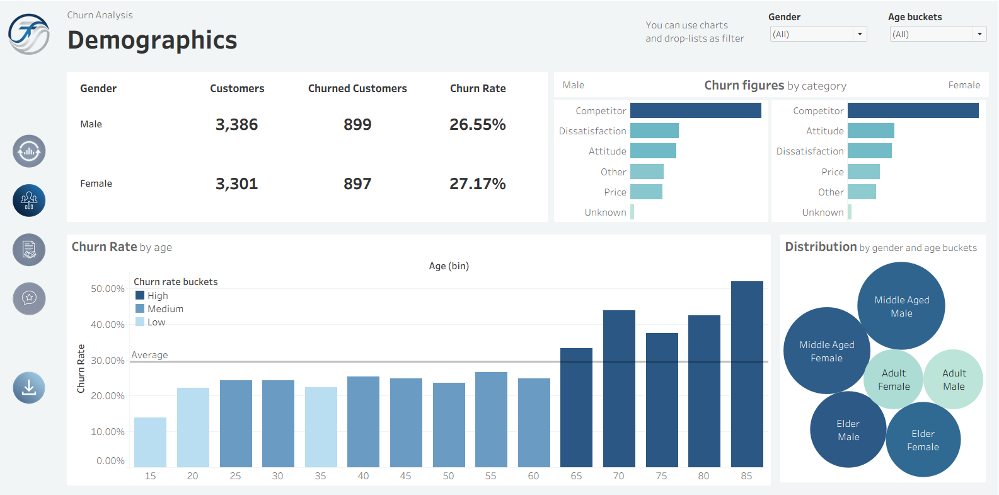
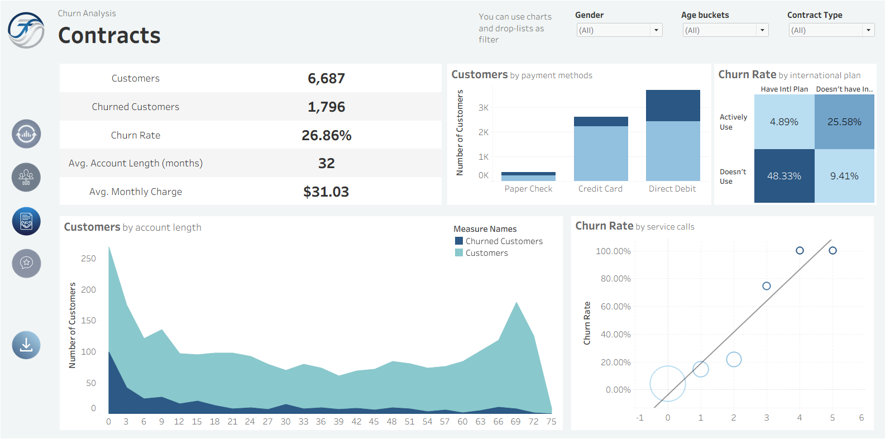
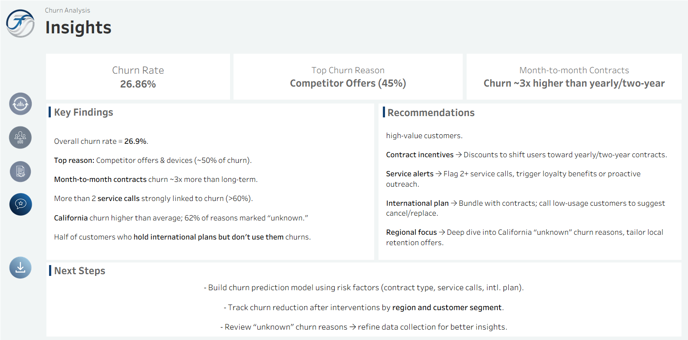

# Telsis Churn Analysis

## About the Project
This project analyzes customer churn behavior for a fictional telecom company, **Telsis**.  
The goal is to identify key factors driving churn and to visualize actionable insights through an interactive Tableau dashboard.  
The workflow covers **data preparation (SQL)**, **business analysis (SQL)**, and **visual storytelling (Tableau)**.

## Data
The dataset contains **6,600+ customer records** with details such as:
- Contract type, payment method, and service usage
- Monthly charges, tenure, and customer satisfaction
- Demographics (gender, age, location)

Source file: `data/telsis_data.csv`

## SQL Queries
1. **Data Preparation (`01_telsis_data_prep.sql`)**  
   - Standardized field names and cleaned the data  
   - Created new analytical fields (e.g., tenure groups, age groups, international usage status etc.)  

2. **Business Questions (`02_business_questions.sql`)**  
- Includes 15+ analytical SQL queries answering churn-related business questions such as:
   - Which 5 states have the highest churn rate?
   - Average monthly charge of churned vs retained customers?
   - Is there any correlation between customer service calls and churn?
- Results guided the Tableau visual design and key metrics  

## Tableau Dashboard
Click any image below to view the **interactive version on Tableau Public**

